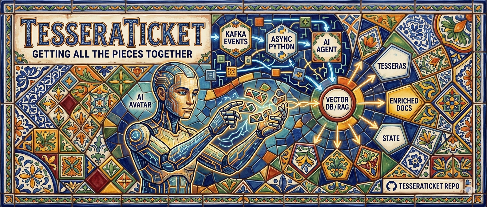

# 🧩 TesseraTicket
### *Getting all the pieces together.*



*A handcrafted banner inspired by the Talavera de la Reina ceramic tradition — a visual metaphor for how TesseraTicket pieces together data from Kafka, async Python, and RAG into a unified support context.*

---

## 🔮 Vision: 100% Auto-Resolved Support

TesseraTicket is built on a simple but radical belief: **an AI can handle 100% of your support tickets once it has all the pieces.** Every error log, every code behavior, every system event is a *tessera* — a small, tagged piece of knowledge. When those tesseras are stitched together by a real-time event backbone, the AI knows your system as deeply as your best engineers.

1. **Everything becomes a tessera.** An error log is converted into a natural-language tessera with structured hashtags. A code function becomes a functional doc tessera. A system event becomes a context tessera.
2. **Your codebase is the documentation.** Source code is parsed into tessera functional docs — the single source of truth the AI uses to understand algorithms and failure modes.
3. **Kafka is the connective tissue.** It transforms raw, isolated signals into enriched, context-packed narratives, ensuring no piece is ever lost.
4. **Hashtags drive enrichment.** Every tessera carries hashtags that make retrieval and correlation instant, turning a ticket into a fully contextualized story.
5. **The result:** a support assistant that resolves tickets autonomously, freeing humans for creative, high-value work.

> TesseraTicket doesn't replace Jira or ServiceNow — it enriches them, making any ticketing platform smarter and more intuitive.

---

## 🧱 Architecture (Current Prototype)

| Component | Role |
|-----------|------|
| **Kafka** | Event backbone — the "John Wayne" of the system, carrying every tessera reliably. |
| **Async Python (FastAPI + aiokafka)** | Producers and consumers that ingest, enrich, and respond to tickets. |
| **Domain-Driven Design** | Bounded contexts (Ticket Management, Knowledge Base, Matching) communicate only via domain events. |
| **PostgreSQL + pgvector** | Stores ticket data and vector embeddings for semantic search. |
| **LangChain + Ollama (local LLM)** | Retrieval-augmented generation: finds relevant tesseras and drafts responses. |

---

## 🚀 Getting Started (Week 1)

```bash
# 1. Clone and start infrastructure
git clone https://github.com/jorge-alegre/tesseraticket.git
cd tesseraticket
docker compose up -d   # Starts Kafka (KRaft) + PostgreSQL + Kafka UI

# 2. Install dependencies
pip install -r requirements.txt

# 3. Run the async ticket producer (FastAPI)
python -m producer.app

# 4. In another terminal, run the async consumer
python -m consumer.main

# 5. Submit a test ticket
curl -X POST http://localhost:8000/tickets \
  -H "Content-Type: application/json" \
  -d '{"title":"Login failure","description":"User cannot log in after password reset","hashtags":["#auth","#login","#bug"]}'
```

Check http://localhost:8080 for the Kafka UI to see messages flowing.

## 📅 Roadmap

Week 1: Kafka + async Python skeleton, dead-letter topic, integration tests

Week 2: DDD bounded contexts, domain events, ticket lifecycle

Week 3: Vector storage with pgvector, embedding generation, semantic search

Week 4: Full RAG pipeline with LangChain + Ollama, draft response generation

Week 5: Monitoring, schema management, performance tuning

Week 6: Polish, comprehensive tests, voice interface design doc

Beyond: Tessera ingestion from codebases (AST → functional docs), self-evolving knowledge mesh, hashtag-based enrichment engine

## 📜 License
MIT © [Jorge Alegre Vilches] — feel free to use, modify, and build upon this project.

## 👤 About the Author

I'm a senior engineer with 20+ years across cybersecurity, banking, telecoms, and startups. I'm building TesseraTicket to sharpen my skills in event-driven architectures, async Python, and AI — and to demonstrate the kind of systems thinking I bring to high-impact, remote-first teams.

https://www.linkedin.com/in/jorgealegre/